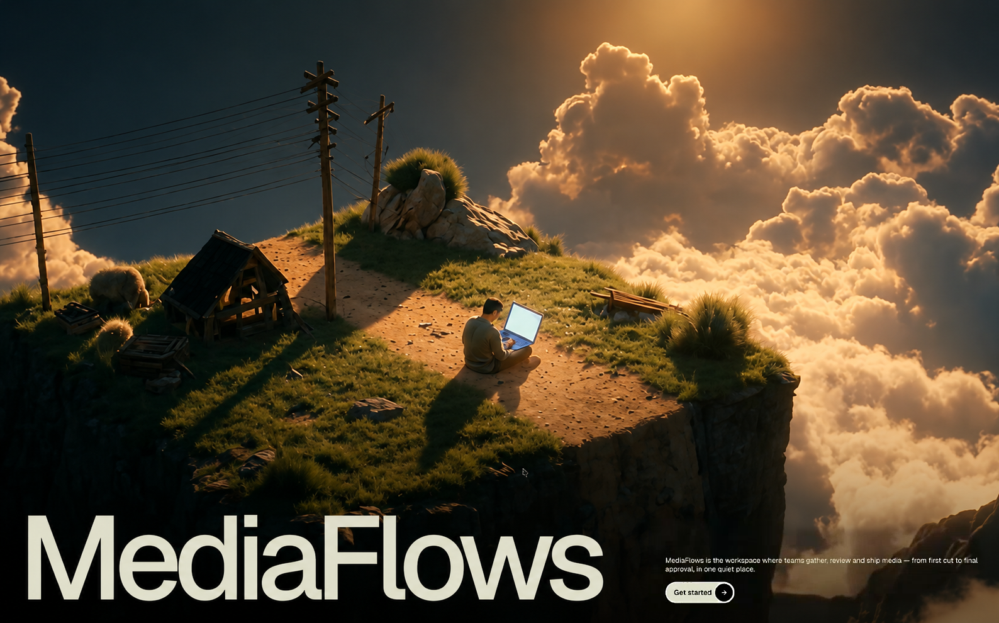
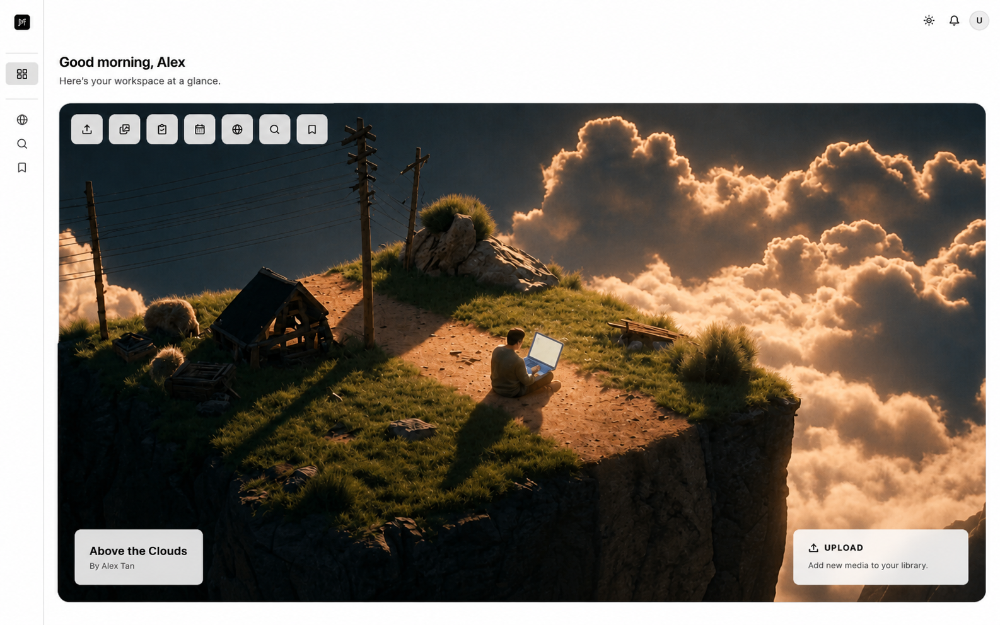
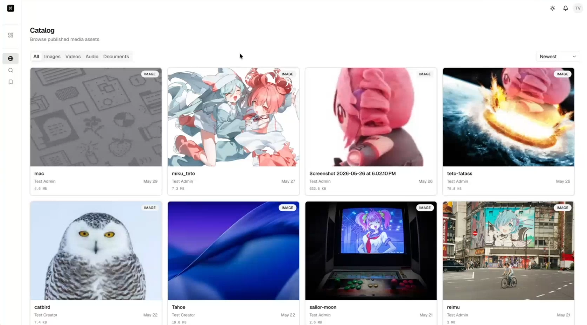
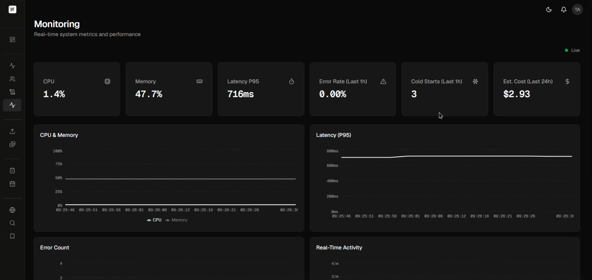
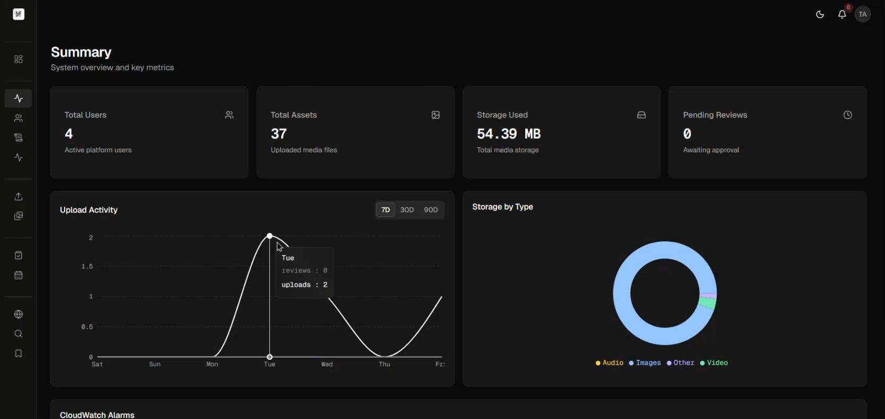
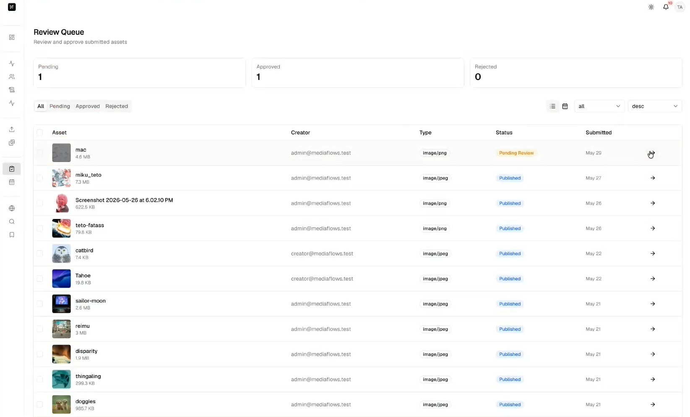
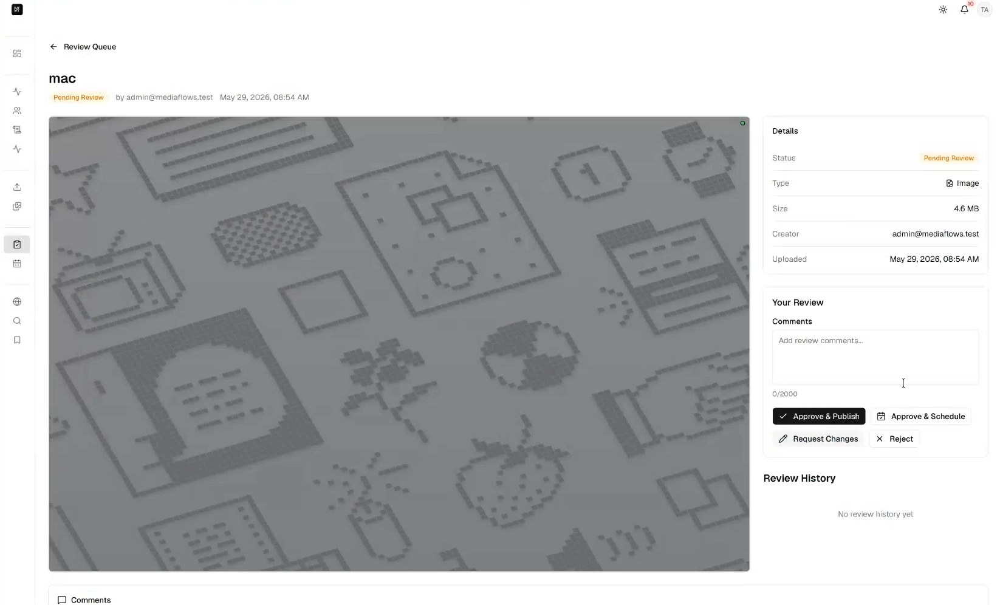

<a id="readme-top"></a>

<!-- PROJECT LOGO -->

<br />
<div align="center">
  <a href="https://github.com/mediaflows-tech/app">
    
  </a>

  <h3 align="center">MediaFlows</h3>

  <p align="center">
    A cloud-native Digital Asset Management platform for the media industry.
    <br />
    <a href="https://github.com/mediaflows-tech/app/issues/new?labels=bug">Bug Report</a>
    &middot;
    <a href="https://github.com/mediaflows-tech/app/issues/new?labels=enhancement">Feature Request</a>
    <br />
  </p>

  <div align="center">

[![TypeScript][TypeScript.org]][TypeScript-url]
[![C#][CSharp.com]][CSharp-url]
[![Next][Next.js]][Next-url]
[![React][React.js]][React-url]
[![Tailwind][Tailwind.com]][Tailwind-url]
[![shadcn/ui][Shadcn.com]][Shadcn-url]
[![.NET][DotNet.com]][DotNet-url]
[![PostgreSQL][PostgreSQL.org]][PostgreSQL-url]
[![DynamoDB][DynamoDB.com]][DynamoDB-url]
[![AWS][AWS.com]][AWS-url]
[![AWS Lambda][Lambda.com]][Lambda-url]
[![Terraform][Terraform.io]][Terraform-url]
[![GitHub Actions][GHA.com]][GHA-url]
[![Playwright][Playwright.dev]][Playwright-url]
[![pnpm][Pnpm.io]][Pnpm-url]

  </div>
</div>

<!-- TABLE OF CONTENTS -->

## Table of Contents

<details>
  <summary>Expand</summary>
  <ol>
    <li><a href="#about-the-project">About The Project</a></li>
    <li><a href="#screenshots">Screenshots</a></li>
    <li>
      <a href="#getting-started">Getting Started</a>
      <ul>
        <li><a href="#prerequisites">Prerequisites</a></li>
        <li><a href="#installation">Installation</a></li>
      </ul>
    </li>
    <li><a href="#usage">Usage</a></li>
    <li><a href="#roadmap">Roadmap</a></li>
    <li><a href="#main-contributors">Main Contributors</a></li>
    <li><a href="#contributing">Contributing</a></li>
    <li><a href="#license">License</a></li>
    <li><a href="#contact">Contact</a></li>
    <li><a href="#acknowledgments">Acknowledgments</a></li>
  </ol>
</details>

<!-- ABOUT THE PROJECT -->

## About The Project

MediaFlows is a Digital Asset Management (DAM) platform that lets media teams ingest, organize, transform, and distribute large volumes of image and video assets from a single workspace. It pairs a Next.js web app with an API-only ASP.NET Core backend on AWS, fronted by Cognito-backed SSO and a CloudFront-served asset CDN.

The repository is split into four top-level workloads:

- `frontend/` — Next.js 16 (App Router) + React 19 + Tailwind v4 web app, deployed to AWS Amplify Hosting.
- `src/` — ASP.NET Core 8 solution (`MediaFlows.Web`, `MediaFlows.Data`, `MediaFlows.Shared`) deployed to Elastic Beanstalk.
- `lambda/` — supporting AWS Lambda functions for async asset processing.
- `infrastructure/` — Terraform (bootstrap + main stack) provisioning the full AWS estate.

<p align="right"><a href="#readme-top">&uarr;</a></p>

<!-- SCREENSHOTS -->

## Screenshots

<p align="center">
  
  <br />
  <em><strong>Landing page</strong> — a cinematic entry point into the workspace.</em>
</p>

<table>
  <tr>
    <td width="50%" valign="top">
      <br />
      <strong>Dashboard</strong> — personalized greeting, role-based quick actions, and a recent-assets carousel.
    </td>
    <td width="50%" valign="top">
      <br />
      <strong>Catalog</strong> — browse published media with content-type filters and trending sort.
    </td>
  </tr>
  <tr>
    <td width="50%" valign="top">
      <br />
      <strong>Live Monitoring</strong> — real-time CPU, latency, error-rate, and cost metrics with streaming charts.
    </td>
    <td width="50%" valign="top">
      <br />
      <strong>Admin Summary</strong> — platform KPIs, upload-activity trends, storage breakdown, and CloudWatch alarms.
    </td>
  </tr>
  <tr>
    <td width="50%" valign="top">
      <br />
      <strong>Review Queue</strong> — triage submissions with status filters and batch approve / reject / schedule.
    </td>
    <td width="50%" valign="top">
      <br />
      <strong>Review &amp; Decide</strong> — inspect an asset, leave comments, and approve, schedule, or reject.
    </td>
  </tr>
</table>

<p align="right"><a href="#readme-top">&uarr;</a></p>

<!-- GETTING STARTED -->

## Getting Started

The repo runs three loosely-coupled workloads. Each has its own README with the deep details; this section gets you to the point where you can build any of them locally.

### Prerequisites

- [Node.js](https://nodejs.org/) 20+ and [pnpm](https://pnpm.io/) 9+ — frontend
- [.NET SDK](https://dotnet.microsoft.com/) 8 — backend
- [AWS CLI](https://aws.amazon.com/cli/) v2 with an `mediaflows` profile — for deploys and SSM lookups
- [Terraform](https://www.terraform.io/) 1.6+ — for `infrastructure/`
- [GitHub CLI](https://cli.github.com/) (`gh`) — for the first-time bootstrap workflow

### Installation

Clone the repo:

```bash
git clone https://github.com/mediaflows-tech/app.git
cd app
```

Then bring up whichever workload you need:

```bash
# Frontend
cd frontend
pnpm install
cp .env.production.example .env.local    # fill in Cognito + API values
pnpm dev                                 # http://localhost:3000

# Backend
dotnet restore MediaFlows.slnx
dotnet run --project src/MediaFlows.Web  # http://localhost:5000

# Infrastructure (first-time deploy)
make deploy                              # see infrastructure/README.md
```

Workload-specific instructions live in [`frontend/README.md`](frontend/README.md) and [`infrastructure/README.md`](infrastructure/README.md).

<p align="right"><a href="#readme-top">&uarr;</a></p>

<!-- USAGE EXAMPLES -->

## Usage

Once deployed behind a custom domain, MediaFlows serves four endpoints:

| Subdomain        | Service                                |
| ---------------- | -------------------------------------- |
| `web.<domain>`   | Next.js frontend (AWS Amplify Hosting) |
| `api.<domain>`   | ASP.NET Core API (Elastic Beanstalk)   |
| `login.<domain>` | Cognito Hosted UI                      |
| `cdn.<domain>`   | CloudFront asset delivery              |

The frontend talks to the API over HTTPS and SignalR (realtime hub), assets are delivered via the CloudFront CDN, and async processing runs through the Lambda pipeline. See [`infrastructure/README.md`](infrastructure/README.md) for how the AWS estate is provisioned.

<p align="right"><a href="#readme-top">&uarr;</a></p>

<!-- ROADMAP -->

## Roadmap

See the [open issues](https://github.com/mediaflows-tech/app/issues) for a full list of proposed features (and known issues).

<p align="right"><a href="#readme-top">&uarr;</a></p>

<!-- MAIN CONTRIBUTORS -->

## Main Contributors

<div align="center">
<table>
  <tr>
    <td align="center" width="25%"><a href="https://github.com/AlaskanTuna"><br /><sub><b>Hee Zi Jie</b></sub></a></td>
    <td align="center" width="25%"><a href="https://github.com/c3638"><br /><sub><b>KH</b></sub></a></td>
    <td align="center" width="25%"><a href="https://github.com/WhiteAvocad0"><br /><sub><b>Jeremy Woon</b></sub></a></td>
    <td align="center" width="25%"><a href="https://github.com/kymil4"><br /><sub><b>Yk</b></sub></a></td>
  </tr>
</table>
</div>

<p align="right"><a href="#readme-top">&uarr;</a></p>

<!-- CONTRIBUTING -->

## Contributing

Contributions are welcome. The usual flow:

1. Fork the repo and create your feature branch (`git checkout -b feat/your-feature`).
2. Commit your changes.
3. Push to your fork and open a Pull Request against `main`.

The CI deploy workflows (`deploy.yml`, `terraform-apply.yml`) ship with their automatic push triggers disabled. Run them manually from the Actions tab (`workflow_dispatch`) once AWS credentials are configured for your account.

<p align="right"><a href="#readme-top">&uarr;</a></p>

<!-- LICENSE -->

## License

No license has been declared. All rights reserved by the project authors. Contact the maintainers before reusing this code.

<p align="right"><a href="#readme-top">&uarr;</a></p>

<!-- CONTACT -->

## Contact

MediaFlows — [@mediaflows-tech](https://github.com/mediaflows-tech)

Project Link: [https://github.com/mediaflows-tech/app](https://github.com/mediaflows-tech/app)

<p align="right"><a href="#readme-top">&uarr;</a></p>

<!-- MARKDOWN LINKS & IMAGES -->

[TypeScript.org]: https://img.shields.io/badge/TypeScript-3178C6?style=for-the-badge&logo=typescript&logoColor=white
[TypeScript-url]: https://www.typescriptlang.org
[Next.js]: https://img.shields.io/badge/next.js-000000?style=for-the-badge&logo=nextdotjs&logoColor=white
[Next-url]: https://nextjs.org/
[React.js]: https://img.shields.io/badge/React-20232A?style=for-the-badge&logo=react&logoColor=61DAFB
[React-url]: https://reactjs.org/
[Tailwind.com]: https://img.shields.io/badge/Tailwind_CSS-38B2AC?style=for-the-badge&logo=tailwind-css&logoColor=white
[Tailwind-url]: https://tailwindcss.com/
[DotNet.com]: https://img.shields.io/badge/.NET-927BE5?style=for-the-badge&logo=dotnet&logoColor=white
[DotNet-url]: https://dotnet.microsoft.com/
[PostgreSQL.org]: https://img.shields.io/badge/PostgreSQL-4169E1?style=for-the-badge&logo=postgresql&logoColor=white
[PostgreSQL-url]: https://www.postgresql.org/
[AWS.com]: https://img.shields.io/badge/AWS-232F3E?style=for-the-badge&logo=data:image/svg%2Bxml;base64,PHN2ZyB4bWxucz0iaHR0cDovL3d3dy53My5vcmcvMjAwMC9zdmciIHdpZHRoPSIxZW0iIGhlaWdodD0iMWVtIiB2aWV3Qm94PSIwIDAgMjQgMjQiPjxwYXRoIGZpbGw9Im5vbmUiIHN0cm9rZT0id2hpdGUiIHN0cm9rZS1saW5lY2FwPSJyb3VuZCIgc3Ryb2tlLWxpbmVqb2luPSJyb3VuZCIgc3Ryb2tlLXdpZHRoPSIyIiBkPSJNMTcuNSAxOUg5YTcgNyAwIDEgMSA2LjcxLTloMS43OWE0LjUgNC41IDAgMSAxIDAgOSIvPjwvc3ZnPg%3D%3D
[AWS-url]: https://aws.amazon.com/
[Terraform.io]: https://img.shields.io/badge/Terraform-7B42BC?style=for-the-badge&logo=terraform&logoColor=white
[Terraform-url]: https://www.terraform.io/
[CSharp.com]: https://img.shields.io/badge/C%23-512BD4?style=for-the-badge&logo=data:image/svg%2Bxml;base64,PHN2ZyB4bWxucz0iaHR0cDovL3d3dy53My5vcmcvMjAwMC9zdmciIHdpZHRoPSIxZW0iIGhlaWdodD0iMWVtIiB2aWV3Qm94PSIwIDAgMjQgMjQiPjxwYXRoIGZpbGw9Im5vbmUiIHN0cm9rZT0id2hpdGUiIHN0cm9rZS1saW5lY2FwPSJyb3VuZCIgc3Ryb2tlLWxpbmVqb2luPSJyb3VuZCIgc3Ryb2tlLXdpZHRoPSIyIiBkPSJNNCA5aDE2TTQgMTVoMTZNMTAgM0w4IDIxbTgtMThsLTIgMTgiLz48L3N2Zz4%3D
[CSharp-url]: https://learn.microsoft.com/dotnet/csharp/
[Shadcn.com]: https://img.shields.io/badge/shadcn%2Fui-000000?style=for-the-badge&logo=shadcnui&logoColor=white
[Shadcn-url]: https://ui.shadcn.com/
[DynamoDB.com]: https://img.shields.io/badge/DynamoDB-4053D6?style=for-the-badge&logo=data:image/svg%2Bxml;base64,PHN2ZyB4bWxucz0iaHR0cDovL3d3dy53My5vcmcvMjAwMC9zdmciIHdpZHRoPSIxZW0iIGhlaWdodD0iMWVtIiB2aWV3Qm94PSIwIDAgMjQgMjQiPjxnIGZpbGw9Im5vbmUiIHN0cm9rZT0id2hpdGUiIHN0cm9rZS1saW5lY2FwPSJyb3VuZCIgc3Ryb2tlLWxpbmVqb2luPSJyb3VuZCIgc3Ryb2tlLXdpZHRoPSIyIj48ZWxsaXBzZSBjeD0iMTIiIGN5PSI1IiByeD0iOSIgcnk9IjMiLz48cGF0aCBkPSJNMyA1djE0YTkgMyAwIDAgMCAxOCAwVjUiLz48cGF0aCBkPSJNMyAxMmE5IDMgMCAwIDAgMTggMCIvPjwvZz48L3N2Zz4%3D
[DynamoDB-url]: https://aws.amazon.com/dynamodb/
[Lambda.com]: https://img.shields.io/badge/AWS_Lambda-FF9900?style=for-the-badge&logo=data:image/svg%2Bxml;base64,PHN2ZyB4bWxucz0iaHR0cDovL3d3dy53My5vcmcvMjAwMC9zdmciIHdpZHRoPSIxZW0iIGhlaWdodD0iMWVtIiB2aWV3Qm94PSIwIDAgMjQgMjQiPjxwYXRoIGZpbGw9Im5vbmUiIHN0cm9rZT0id2hpdGUiIHN0cm9rZS1saW5lY2FwPSJyb3VuZCIgc3Ryb2tlLWxpbmVqb2luPSJyb3VuZCIgc3Ryb2tlLXdpZHRoPSIyIiBkPSJNNCAxNGExIDEgMCAwIDEtLjc4LTEuNjNsOS45LTEwLjJhLjUuNSAwIDAgMSAuODYuNDZsLTEuOTIgNi4wMkExIDEgMCAwIDAgMTMgMTBoN2ExIDEgMCAwIDEgLjc4IDEuNjNsLTkuOSAxMC4yYS41LjUgMCAwIDEtLjg2LS40NmwxLjkyLTYuMDJBMSAxIDAgMCAwIDExIDE0eiIvPjwvc3ZnPg%3D%3D
[Lambda-url]: https://aws.amazon.com/lambda/
[GHA.com]: https://img.shields.io/badge/GitHub_Actions-2088FF?style=for-the-badge&logo=githubactions&logoColor=white
[GHA-url]: https://github.com/features/actions
[Playwright.dev]: https://img.shields.io/badge/Playwright-2EAD33?style=for-the-badge&logo=data:image/svg%2Bxml;base64,PHN2ZyB4bWxucz0iaHR0cDovL3d3dy53My5vcmcvMjAwMC9zdmciIHdpZHRoPSIxZW0iIGhlaWdodD0iMWVtIiB2aWV3Qm94PSIwIDAgMjQgMjQiPjxnIGZpbGw9Im5vbmUiIHN0cm9rZT0id2hpdGUiIHN0cm9rZS1saW5lY2FwPSJyb3VuZCIgc3Ryb2tlLWxpbmVqb2luPSJyb3VuZCIgc3Ryb2tlLXdpZHRoPSIyIj48cGF0aCBkPSJNMTAgMTFoLjAxTTE0IDZoLjAxTTE4IDZoLjAxTTYuNSAxMy4xaC4wMU0yMiA1YzAgOS00IDEyLTYgMTJzLTYtMy02LTEycTAtMyA2LTNjNiAwIDYgMSA2IDMiLz48cGF0aCBkPSJNMTcuNCA5LjljLS44LjgtMiAuOC0yLjggMG0tNC41LTIuOEM5IDcuMiA3LjcgNy43IDYgOC42Yy0zLjUgMi00LjcgMy45LTMuNyA1LjZjNC41IDcuOCA5LjUgOC40IDExLjIgNy40Yy45LS41IDEuOS0yLjEgMS45LTQuNyIvPjxwYXRoIGQ9Ik05LjEgMTYuNWMuMy0xLjEgMS40LTEuNyAyLjQtMS40Ii8%2BPC9nPjwvc3ZnPg%3D%3D
[Playwright-url]: https://playwright.dev/
[Pnpm.io]: https://img.shields.io/badge/pnpm-F69220?style=for-the-badge&logo=pnpm&logoColor=white
[Pnpm-url]: https://pnpm.io/
